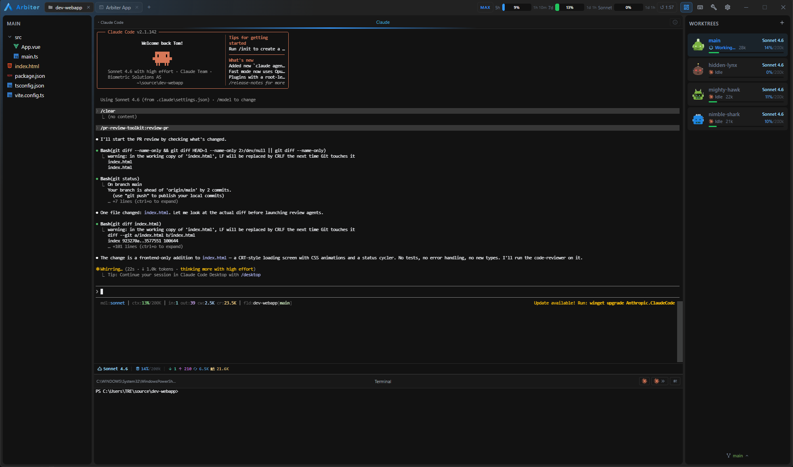

<div align="center">


# Arbiter

**Run many Claude Code sessions side by side.**

One window. Many agents. You decide who works on what.

</div>

---

<p align="center">
  
</p>

## About

Arbiter is a cross-platform desktop app for running multiple [Claude Code](https://claude.com/claude-code) CLI sessions in parallel. Split your workspace into as many terminal panes as you need — each one an independent shell with its own agent. Spawn a session per feature, per repo, or per concern, and watch them work side by side.

The name comes from the idea of a single commanding authority overseeing many agents below it. You are the arbiter.

> Still a work in progress.

## Features

- **Tiled terminal panes.** Split any pane vertically or horizontally, resize with the keyboard, navigate with arrow keys.
- **Independent shells.** Each pane is a real PTY — `bash`, `zsh`, or PowerShell — so any CLI works, not just Claude Code.
- **Claude-aware.** Detects Claude Code processes per pane and surfaces model, token usage, and idle/working state in the footer.
- **Worktrees panel.** Manage Git worktrees from the sidebar with per-worktree status indicators.
- **Usage at a glance.** 5-hour and 7-day Claude utilization in the title bar, refreshed on its own from your `claude.ai` session.
- **Layout persistence.** Pane tree, working directories, and Claude session IDs are saved between launches so you can resume mid-flow.
- **Event-driven, not polled.** Filesystem watchers, OSC escape parsing, and Tauri events keep CPU idle when nothing is happening.

## Keyboard shortcuts

| Shortcut             | Action                                |
| -------------------- | ------------------------------------- |
| `Ctrl+Shift+R`       | Split focused pane vertically         |
| `Ctrl+Shift+D`       | Split focused pane horizontally       |
| `Ctrl+Shift+W`       | Close focused pane                    |
| `Ctrl+Shift+Arrow`   | Navigate to a neighboring pane        |
| `Alt+Shift+Arrow`    | Resize the focused pane's boundary    |

## Stack

- [Tauri 2](https://tauri.app) — native shell (Rust)
- [Vue 3](https://vuejs.org) + TypeScript + [Pinia](https://pinia.vuejs.org)
- [xterm.js](https://xtermjs.org) — terminal rendering with the WebGL renderer
- [portable-pty](https://crates.io/crates/portable-pty) — real PTYs on Windows, macOS, and Linux

## Develop

```bash
npm install
npm run tauri dev
```

## Build

```bash
npm run tauri build
```

Bundles are written to `src-tauri/target/release/bundle/`.
