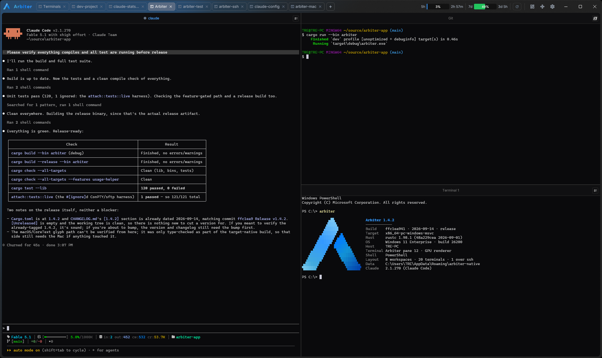

<div align="center">


# Arbiter

**A lightweight, cross-platform terminal for running many Claude Code sessions side by side.**

One window. Many agents. You decide who works on what.

</div>

---

<p align="center">
  
</p>

## What it is

Arbiter is a desktop terminal built for running a bunch of [Claude Code](https://claude.com/claude-code) sessions at once, in the same window. Split your space into as many terminal panes as you want, group them into tabs, and let the agents work in parallel while Arbiter keeps an eye on who is busy, who is done, and who is waiting on you.

The name is the idea behind it. One authority keeping an eye on the agents below. You are the arbiter.

## Why it exists

- **Lightweight.** A native Rust app with a custom GPU terminal renderer. No browser engine, no Electron. Everything is event driven, so it uses nothing while nothing is happening, and it lets your display sleep.
- **Cross-platform, and the same everywhere.** One codebase, one look, one set of shortcuts on Windows and macOS. Text is rasterised with each OS's own engine (DirectWrite, CoreText) so it reads like a native terminal on both.
- **Fast.** Terminal output is parsed by the same engine Alacritty uses and drawn straight to the GPU. Redraws happen on output, not on a clock.
- **It picks up where you left off.** Close Arbiter, open it again, and your tabs, panes, directories and running Claude sessions come back, including the ones on other machines over SSH. Resume is Claude Code specific today; other programs come back to a shell in the right place.

## Tabs and terminals

Workspaces live in tabs along the top. Open as many as you like, move between them with `Ctrl+Tab`, or jump straight to one with `Ctrl+1` through `Ctrl+9`. Each tab is a tiling grid of terminal panes: split a pane to the right with `Ctrl+Shift+R` or down with `Ctrl+Shift+D`, drag the borders with the mouse or nudge them with `Alt+Shift+Arrow`, and move focus between panes with `Ctrl+Shift+Arrow`.

Every pane is a real PTY running your shell: PowerShell or Git Bash on Windows, zsh or bash on macOS. Claude Code is the obvious thing to put in there, but anything works. Each terminal keeps its own private command history across restarts, has find (`Ctrl+F`), a right-click menu (rename, rename to the repo's name, clear, split, copy, paste, reconnect), and truecolor.

## Status at a glance

Arbiter knows what Claude is doing in every pane, whether it runs locally or on the far side of an SSH connection:

- **Idle**, ready for input.
- **Working**, shown as Claude's own animated spinner.
- **Needs attention**, amber, when Claude is waiting on a permission or a question.
- A green dot when a shell is running an ordinary command.

The dots sit in each pane's header and roll up to the workspace tab, so a tab tells you when something inside it needs you.

**The overview window** is the same information as a compact list: every workspace, every terminal, its Claude state, and its git status (staged, unstaged, untracked). It opens with `Ctrl+Shift+O` and can stay on top of everything else, so when the main window is covered or minimised you still see who is working and who is waiting. Click a row to jump to that pane. It can be filtered to Claude panes only.

**Claude usage in the title bar.** Your 5 hour and 7 day usage from claude.ai, refreshing on its own.

## Sessions stick around

Arbiter saves continuously and restores on launch: the pane layout of every tab with exact split sizes, each terminal's working directory, the window size and position, and which panes had Claude running. Those panes relaunch Claude with `claude --resume` on the exact conversation, thanks to a small shim that runs as Claude's status line and learns each pane's session id. An unexpected quit does not cost you your layout.

## SSH

Remote terminals are first class. Type `ssh host` in a pane and Arbiter treats that pane as remote from then on:

- **It comes back.** On the next launch the connection is replayed, in the directory you were in, and if Claude was running there it comes back too (`claude -c`, or the exact conversation with the "Name remote Claude sessions" setting).
- **One sign-in for everything.** Restoring several connections asks once, in one dialog, with a field per connection that says whether it wants a key passphrase or a password and for what. Secrets live in memory for the app's lifetime only, never on disk, and answer every later reconnect. A switch per connection leaves that one at its local prompt instead.
- **Drops heal.** A lost connection is retried once on its own; after that an amber Reconnect button in the pane header brings it back with one click, keeping the scrollback. A deliberate `exit` turns the pane back into an ordinary local terminal.
- **Nothing to install remotely.** Detection works from the terminal stream alone. An optional one-line snippet for the remote shell makes the remote directory exact.

## The `arbiter` command

Type `arbiter` in any pane for the mark turning in ASCII, followed by the version, the commit it was built from, the target and compiler, your OS and host, the shell, the saved layout, the data directory and the Claude version. `arbiter --version` prints one line.

## Settings

Font size, scrollback length, background colour and bold style for the terminals; whether to confirm before quitting; the overview's always-on-top, Claude-only and usage-footer options; a screenshot folder; and the remote Claude session naming described above.

## A few more things

- **Drag and drop.** Drop files or images onto a Claude pane to attach them. `Ctrl+Shift+S` grabs a screenshot and `Ctrl+Shift+A` opens a file picker.
- **Shift+Enter** inserts a newline in Claude, locally and over SSH.
- **Quit and close confirmations** so a stray click cannot drop a workspace full of agents.

## Keyboard shortcuts

| Shortcut | Action |
| --- | --- |
| `Ctrl+Shift+T` | New workspace |
| `Ctrl+Tab` | Next workspace |
| `Ctrl+Shift+Tab` | Previous workspace |
| `Ctrl+1` to `Ctrl+9` | Switch to workspace 1 to 9 |
| `Ctrl+Shift+W` | Close pane or workspace |
| `Ctrl+Shift+R` | Split right |
| `Ctrl+Shift+D` | Split down |
| `Ctrl+Shift+Arrow` | Navigate panes |
| `Alt+Shift+Arrow` | Resize panes |
| `Ctrl+Shift+E` | Equalize pane sizes |
| `Ctrl+F` | Find in terminal |
| `Ctrl+Shift+O` | Workspace overview |
| `Ctrl+Shift+S` | Attach screenshot |
| `Ctrl+Shift+A` | Attach files |

## Built with

- [Rust](https://www.rust-lang.org) and [iced](https://iced.rs), drawing every pane on the GPU with [wgpu](https://wgpu.rs)
- [alacritty_terminal](https://crates.io/crates/alacritty_terminal) for VT parsing
- [portable-pty](https://crates.io/crates/portable-pty) for real PTYs (ConPTY on Windows)
- DirectWrite on Windows and CoreText on macOS for text that matches each platform's own terminal

## Run it

```bash
cargo run --bin arbiter
```

Point `ARBITER_DATA_DIR` at a scratch folder to try things without touching your saved layout.

## Build it

A release binary:

```bash
cargo build --release --bin arbiter
```

Installers (.dmg on macOS, .exe on Windows) are produced with [cargo-packager](https://crates.io/crates/cargo-packager):

```bash
cargo packager --release
```

## Downloads

Grab the latest build for your platform from the [Releases page](https://github.com/tre87/arbiter-app/releases/latest).
